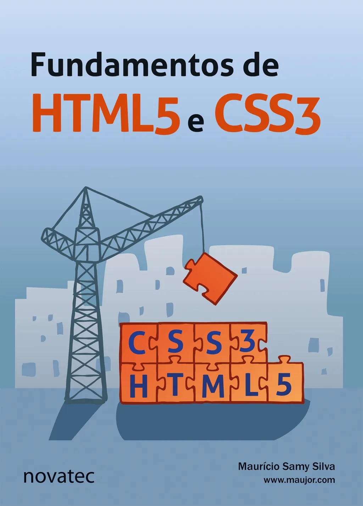

# book-html5_css3

HTML and CSS Studies from the book "Fundamentos de HTML5 e CSS3" by Maurício "Maujor" Samy Silva (Novatec).
Copyright 2015 from Novatec Editora Ltda.

ISBN: 978-85-7522-438-0

The site to buy the book: [Amazon](https://www.amazon.com.br/Fundamentos-Html5-Css3-Maur%C3%ADcio-Silva/dp/8575224387/ref=asc_df_8575224387/?tag=googleshopp00-20&linkCode=df0&hvadid=379748659420&hvpos=&hvnetw=g&hvrand=3729269001473255156&hvpone=&hvptwo=&hvqmt=&hvdev=c&hvdvcmdl=&hvlocint=&hvlocphy=9074128&hvtargid=pla-811137648608&psc=1)

All codes were based on the cited book.

## Contents

1. Histórico, ferramentas e terminologia
2. Marcação HTML
3. Elementos HTML
4. Introdução às CSS
5. DOM e seletores CSS
6. Posicionamento CSS
7. Construção de layout
8. Estilização
9. Formulários
- Elementos da HTML 5
- Propriedades CSS
- Cores CSS
- Referências
- Índice remissivo